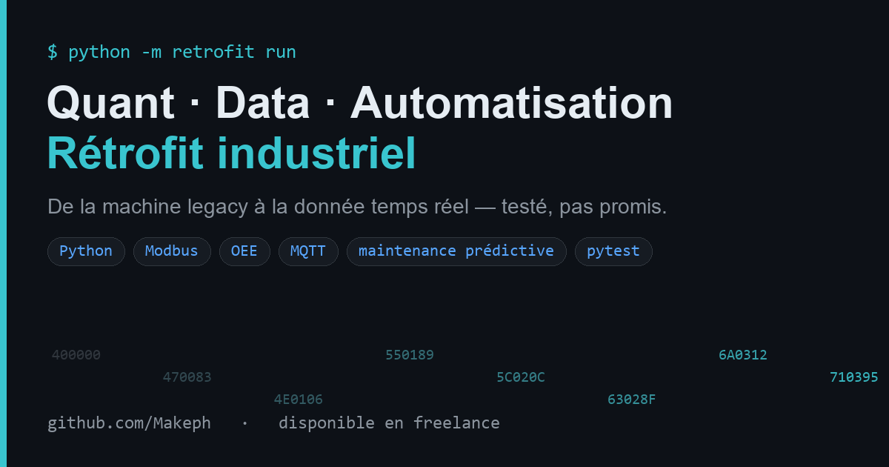

# industrial-retrofit

**Donner une voix data moderne à une machine ancienne.**
Registres Modbus bruts → télémétrie propre → détection d'anomalie (maintenance prédictive) → **OEE en temps réel**.



Une machine industrielle de 1995 ne parle que des registres 16 bits : pas d'unités, pas
de contexte, aucune remontée réseau. Ce projet est la **couche de rétrofit** qui transforme
ce flux brut en télémétrie exploitable — sans toucher à l'automate, sans remplacer la machine.

```
  ┌────────────┐   Modbus      ┌──────────────────┐   JSON       ┌────────────┐
  │  Machine    │  registres    │  RetrofitBridge   │  télémétrie  │  MQTT /     │
  │  legacy     │ ────────────▶ │  décode · unités  │ ───────────▶ │  TSDB /     │
  │  (PLC)      │  0,1,2,3...    │  anomalie · OEE   │              │  dashboard  │
  └────────────┘               └──────────────────┘              └────────────┘
```

## Ce que ça fait

- **Décodage** — 8 registres 16 bits → dict typé en unités SI (°C, mm/s, rpm), horodaté,
  prêt à publier sur MQTT / InfluxDB / un dashboard.
- **Maintenance prédictive** — détection d'anomalie en ligne, pur stdlib (tourne sur une
  passerelle edge) : z-score glissant pour les pics, EWMA pour la dérive lente d'usure de
  roulement → **alarme avant la panne**.
- **OEE temps réel** — Disponibilité × Performance × Qualité, accumulé sur le poste.
- **Pilote neutre** — le bridge lit n'importe quel client exposant
  `read_holding_registers(address, count)` : le simulateur fourni **ou** un vrai
  `pymodbus.ModbusTcpClient`. Le code de décodage ne change pas.

## Démarrage rapide

```bash
pip install -e .
python -m retrofit run --ticks 400 --seed 5
```

```
t=   222s    fault  rpm= 1819  T= 56.8C  vib=2.45mm/s  OEE= 69.1% !ANOMALY
...
-- shift summary --------------------------------
availability  70.2%   performance 100.0%   quality  96.4%
OEE           67.8%   parts 271 good / 10 reject
```

En Python :

```python
from retrofit import LegacyMachine, RetrofitBridge

machine = LegacyMachine(seed=1)
bridge  = RetrofitBridge(client=machine, ideal_cycle_s=2.0)

for rec in bridge.stream(ticks=600, machine=machine):
    if rec["maintenance_alarm"]:
        print("⚠ usure roulement — planifier maintenance", rec["vib_ewma"], "mm/s")
```

### Brancher un vrai automate

```python
from pymodbus.client import ModbusTcpClient
from retrofit import RetrofitBridge

client = ModbusTcpClient("192.168.0.10", port=502)   # même interface read_holding_registers
bridge = RetrofitBridge(client=client)
while True:
    print(bridge.poll())
```

## Architecture

| Module | Rôle |
|--------|------|
| `machine_sim.py` | Simule la machine legacy + sa table de registres Modbus |
| `bridge.py` | Le rétrofit : lecture → décodage → anomalie → OEE → record JSON |
| `anomaly.py` | `RollingZScore` (pics) + `EwmaTrend` (dérive d'usure), pur stdlib |
| `oee.py` | Disponibilité / Performance / Qualité / OEE + accumulateur poste |
| `cli.py` | `python -m retrofit run` |

## Tests

```bash
pytest -q          # 9 passed
```

## Stack

Python 3.9+ · zéro dépendance pour le cœur · `pymodbus` optionnel pour le terrain ·
`pytest` · assets visuels via Pillow/numpy/imageio.

---
MIT · construit pour montrer un rétrofit industriel honnête et testable.
